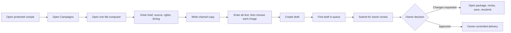
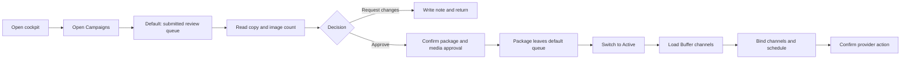
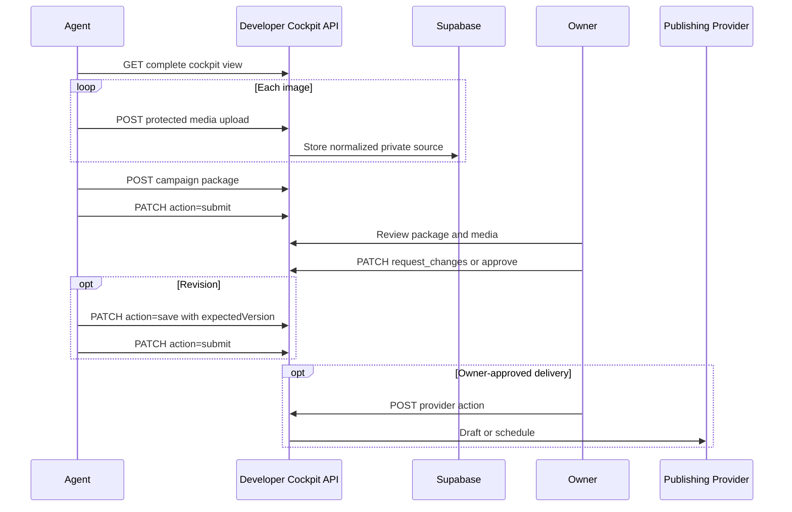
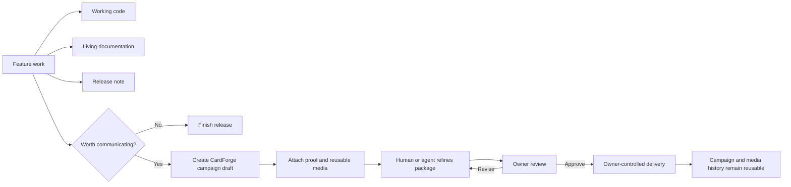

# Developer Cockpit UX and Media Workflow Audit

## Objective and guardrails

This audit treats the architecture merged in PR #88 as the baseline. It evaluates whether the Developer Contribution Cockpit is pleasant and efficient for contributors, owners, and AI Work Agents without changing feature ownership, permissions, rollout gates, or provider boundaries.

The following remain authoritative:

- `developer-access` owns developer identity, status, and contribution scopes.
- `developer-cockpit` owns campaign packages, site proposals, approval history, and CardForge media workflow.
- Supabase owns durable CardForge package and media state.
- `social-publishing` owns the server-only provider adapter.
- Buffer owns channel connections, scheduling, and delivery.
- Only an owner can approve media, publish site copy, or initiate provider delivery.
- No recommendation in this audit enables Buffer, changes a rollout gate, or exposes raw storage buckets.

## Audit method

The audit traced the merged UI, client requests, API routes, persistence stores, storage promotion path, provider adapter, lifecycle rules, and access checks. The local role walkthrough used the current contributor and owner states, including drafts, submitted packages, requested revisions, approved packages, provider drafts, failures, published history, and cancelled history.

Click counts below measure deliberate navigation and action clicks, not typing or choices inside the operating-system file picker.

## Current workflows

### Contributor



For an existing contributor creating a one-channel package with one image, the baseline requires approximately six action clicks: Campaigns, New Package, Add Image, native file selection, Create Draft, and Submit. Each additional channel or image adds at least one action. The click count is reasonable; the larger friction is that the flat form does not show what makes the package review-ready.

### Owner



The baseline owner flow has two material problems:

1. Approval is requested without displaying the images or the package's source, rights, destination, and requested timing in the review card.
2. An approved package immediately stops matching the default review filter, forcing the owner to find it again before provider setup.

Approval-to-schedule takes roughly eight action clicks and one avoidable queue change. More importantly, the owner cannot make a high-confidence media decision from the original card.

### AI Work Agent



For `N` images, initial agent creation currently requires `N + 3` requests when the agent first reads the cockpit, uploads media, creates the draft, and submits it. The API correctly preserves scope checks, optimistic versions, rate limits, private media, and owner-only approval. Its main agent friction is that every successful mutation returns the entire cockpit view and there is no dry-run validation or idempotency key.

## Findings and implemented polish

| Priority | Finding | Effect | PR #89 response |
| --- | --- | --- | --- |
| P0 | Review cards showed copy and an image count, not media proof. | Owners could approve media without seeing it. | Show visual media proof, alt text, source/public state, destination, source/release, rights, timing, and delivery history in the package. |
| P0 | Approved packages left the default owner queue. | Approval and provider setup felt like separate searches. | Make the default owner view **Needs owner action**, covering submitted, approved, provider-draft, and failed packages. |
| P0 | The composer was one undifferentiated form. | Contributors felt they were filling fields rather than producing an asset. | Group the composer into Brief, Production Context, and Channel Deliverables with a visible readiness checklist. |
| P1 | The top-level **Library** label referred to Studio asset contributions, not campaign media. | It implied that a campaign media catalog already existed. | Rename it **Asset Contributions**. Reserve “Media Library” for the recommended owner catalog. |
| P1 | Additional channel copy always started blank. | Contributors repeated boilerplate before adapting it. | Allow a channel variant to start from the primary channel copy while keeping editing explicit. |
| P1 | Overview metrics were passive. | Common work required another navigation decision. | Make campaign, site, and provider metrics open their working surfaces directly. |

The polish deliberately does not alter persistence, access rules, media promotion, provider mutations, or rollout flags.

## Human experience

The baseline used package terminology but visually behaved like a database form followed by a record list. A production-oriented experience needs to answer four questions continuously:

1. What story are we producing?
2. What development work and rights support it?
3. What are the actual channel deliverables?
4. What decision or action happens next?

The revised composer and package review surface make those answers visible. A contributor can see readiness before saving, and an owner reviews the package as a production asset rather than inferring quality from field counts.

## Proposed agent-facing workflow

Keep the current authenticated, scope-checked API and action lifecycle. Improve it incrementally:

1. Add a campaign-only list/read response with cursor pagination and status filters so agents do not need developer profiles, site blocks, and unrelated queues.
2. Add non-mutating campaign validation that returns normalized fields, blocking errors, production-readiness warnings, and allowed next actions.
3. Return the created or changed campaign resource alongside its version instead of requiring an agent to search the full cockpit response.
4. Accept a client-generated idempotency key for campaign creation and media ingestion to prevent duplicates after retries.
5. Once structured associations exist, let agents attach development references by kind and URL without receiving any GitHub mutation privileges.
6. Once a media registry exists, return stable CardForge media IDs instead of storage bucket/path pairs.

A clean agent sequence would then be:

```text
validate package
  -> ingest or reuse protected media
  -> create idempotent draft
  -> attach CardForge-owned development references
  -> submit
  -> read owner feedback
  -> revise with expected version
  -> resubmit
```

Approval, public media promotion, site publication, channel loading, provider drafting, and scheduling remain owner-only.

## Media Library recommendation

CardForge should introduce an owner-only **Campaign Media Library** inside the Developer Cockpit, not inside the general Owner Console and not inside the Studio asset-contribution library.

The cockpit is the correct surface because the catalog exists to support campaign production, review, reuse, and publication history. The existing **Asset Contributions** area serves a different product lifecycle: Studio assets, voting, tiering, and catalog publication.

The library must be a visual metadata catalog over CardForge-owned Supabase media. It must never expose raw bucket browsing.

Recommended capabilities:

- Visual grid and detail views with approved/private state.
- Search across caption, alt text, credit, contributor, campaign, release, feature, and publication.
- Reuse by stable media ID without uploading another binary.
- Exact duplicate detection using a content hash; optional similarity suggestions using a perceptual hash.
- Width, height, MIME type, byte size, derivative count, and aggregate storage statistics.
- Contributor attribution and asset-level rights/credit.
- Campaign relationships and channel-specific attachment history.
- Approval state and the owner decision that made a derivative public.
- Publication history derived from CardForge provider jobs.
- Focal point and derivative previews without exposing object paths.

This is not a second media system. Supabase remains the binary owner. The library is the missing CardForge metadata index and relationship layer over the existing protected/public storage lanes.

## Media package audit

| Concern | Current state | Recommendation |
| --- | --- | --- |
| Source media | Uploads are normalized to WebP and stored privately; the original binary is not retained. | Decide explicitly whether “source” means normalized master or retained original. For long-term production, retain an immutable protected original and a normalized master when rights and storage policy permit. |
| Generated derivatives | A normalized private image is copied to a public object on approval; derivative identity is not modeled. | Give derivatives stable IDs with dimensions, format, purpose, crop, and parent media ID. |
| Captions | Channel post text exists; asset-level caption does not. | Add an optional reusable caption/description at media level. Keep channel copy on the package variant. |
| Alt text | Required per package attachment. | Preserve attachment-level alt text because context can change by campaign; optionally seed it from media metadata. |
| Ownership | Free-form package-level rights note. | Add media-level creator, credit, rights basis, and optional expiry/restriction. Keep the package note for campaign-specific context. |
| Release associations | One free-form source reference. | Add structured, many-to-many CardForge associations while retaining a human note. |
| Campaign history | Durable campaign status and versions. | Preserve; link media by stable ID so reuse is visible across campaigns. |
| Contributor attribution | Stored on the campaign. | Preserve campaign attribution and add media-ingestion attribution. |
| Publishing history | Durable provider jobs by campaign/channel. | Preserve; expose related deliveries from the media catalog without making Buffer the history owner. |
| Intrinsic metadata | Upload response has dimensions, but the package does not persist dimensions, MIME type, bytes, or hashes. | Persist intrinsic metadata at media ingestion. |
| Crop intent | Not modeled. | Add an optional focal point before generating aspect-ratio derivatives. |

The smallest durable media record should own intrinsic facts and rights. Campaign attachments should own context: order, channel, alt text, crop choice, and optional caption override.

## Development integration

GitHub should remain development history; CardForge should remain campaign history.

Replace the single free-form source reference over time with CardForge-owned associations:

| Kind | Stored CardForge context |
| --- | --- |
| Pull request | Provider, repository, number, canonical URL, captured title |
| Commit | Repository, SHA, canonical URL |
| Release | Version/tag, release URL, released-at timestamp |
| Feature | Stable CardForge feature key and title |
| Asset | Stable CardForge asset ID |
| Jam recording | Canonical URL, title, optional captured thumbnail |

Associations should be references, not live dependencies. A renamed or unavailable GitHub/Jam resource must not erase CardForge campaign history.

## Continuous production

Every meaningful feature should naturally leave behind code, current documentation, release notes, and—when the work is externally meaningful—a campaign package and reusable media.



The easiest integration point is a non-publishing release helper that pre-fills a draft with the release title, summary, development associations, and captured proof. An agent or contributor completes rights, alt text, channel copy, and media choices. The owner still makes every approval and delivery decision.

## Low-risk automation

Safe automation produces drafts and suggestions, never public actions:

- Generate thumbnails and common aspect-ratio derivatives from an approved focal point.
- Suggest focal crops and let a human choose.
- Draft alt text, captions, metadata, and channel variants with visible provenance.
- Draft release notes from merged work and link them back to the release.
- Detect exact duplicates on ingestion and suggest likely visual duplicates.
- Pre-fill a campaign draft from a PR, release, feature, asset, or Jam recording.
- Validate image dimensions, rights completeness, missing alt text, broken destinations, and channel length before submission.

Every generated result should record its source and remain editable. No automation may approve media, promote public objects, publish site content, create provider drafts, schedule posts, or publish automatically.

## Prioritized roadmap

### P0 — Audit polish in PR #89

- Show complete package proof during owner review.
- Keep owner-actionable packages in one queue through approval and provider preparation.
- Add composer readiness, production grouping, and clearer navigation language.
- Preserve all PR #88 ownership and rollout boundaries.

### P1 — Agent contract and continuous-production links

- Add scoped campaign list/read and non-mutating validation responses.
- Return changed resources and allowed actions.
- Add idempotency keys.
- Add structured development associations owned by CardForge.
- Add a release/PR-to-draft helper that cannot publish.

This can be a normal product PR if it does not change permissions or production providers.

### P2 — Canonical campaign media registry

- Index existing protected/public CardForge media with stable IDs and intrinsic metadata.
- Add campaign/media relationships, reuse, attribution, rights, duplicate hashes, focal points, and storage statistics.
- Build the owner-only Campaign Media Library and a contributor-scoped reuse picker.
- Migrate current package-embedded media references without changing Supabase binary ownership.

This requires a separate high-risk migration PR with explicit rollback, least-privilege review, advisor checks, and production verification.

### P3 — Assisted derivatives and drafting

- Generate reviewed thumbnails and aspect-ratio derivatives.
- Add optional caption, alt-text, release-note, and metadata drafting.
- Record automation provenance and require human confirmation.

### Deferred deliberately

- Buffer production enablement.
- Rollout-gate changes.
- Automatic publishing.
- Provider analytics ingestion.
- A second storage or media-ownership system.
- Any weakening of owner review or contributor scopes.
